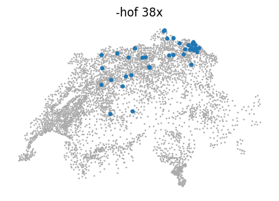
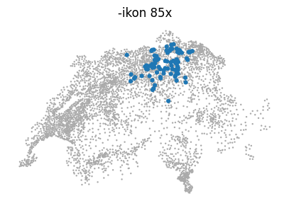
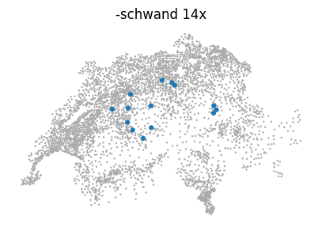
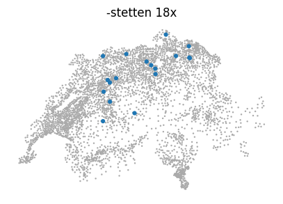
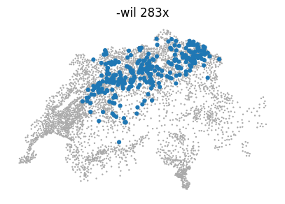

# Where are typical Swiss placename suffixes used?

The [etymology](https://www.aargauerzeitung.ch/aargau/freiamt/fast-alle-freiamter-ortsnamen-sind-alemannisch-was-es-mit-ikon-und-wil-auf-sich-hat-ld.1526719) and the [article](https://roaldin.ch/plaatsikon) for my blog.

